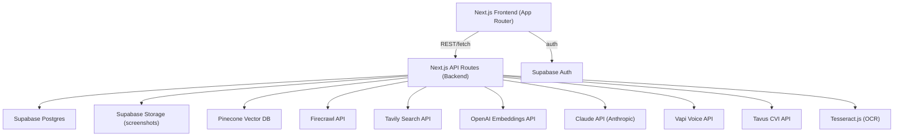

# Design Document

## Overview

NetWork is a Next.js web application that guides users through three sequential phases for professional networking preparation:

1. **Intel Gathering** — user provides event/participant context; the system scrapes, searches, and embeds intel into Pinecone
2. **Practice Mode** — user selects a Person Card and starts a voice (Vapi) or video (Tavus CVI) roleplay session with an AI Persona
3. **Debrief** — after the session, Claude API analyzes the transcript and returns a structured feedback report

The MVP has no tier gating. All users get access to both voice and video. The architecture is designed so tier enforcement, additional modes, and Stripe billing can be layered on without structural changes.

---

## Architecture



All external API calls are made server-side from Next.js API routes. The client never holds API keys. Supabase Auth issues JWTs that are validated on every API route.

---

## Components and Interfaces

### Frontend Pages (Next.js App Router)

| Route | Purpose |
|---|---|
| `/` | Landing / mode selector (MVP: only Professional Networking) |
| `/prep` | Context input form + intel gathering status |
| `/prep/[contextId]` | Cheat sheet view — Talking Points Card + Person Cards |
| `/session/[sessionId]` | Active voice or video practice session |
| `/debrief/[sessionId]` | Post-session feedback report |
| `/history` | Session history list + progress dashboard |
| `/auth/login` | Sign in |
| `/auth/register` | Sign up |

### API Routes

| Route | Method | Purpose |
|---|---|---|
| `/api/context` | POST | Submit context input, trigger intel pipeline |
| `/api/context/[contextId]` | GET | Fetch generated Talking Points Card + Person Cards |
| `/api/session` | POST | Start a voice or video session (places Minute Reservation) |
| `/api/session/[sessionId]` | GET | Fetch session status / transcript |
| `/api/session/[sessionId]/status` | GET | Poll for Tavus persona creation status (video sessions) |
| `/api/session/[sessionId]/end` | POST | End session, reconcile minutes, trigger debrief |
| `/api/debrief/[sessionId]` | GET | Fetch debrief report |
| `/api/history` | GET | Fetch session list for authenticated user |
| `/api/history/progress` | GET | Fetch per-dimension average scores for current billing period |
| `/api/user/export` | GET | Export all user data as JSON |
| `/api/user` | DELETE | Delete account and all associated data |

### Service Layer (server-side modules)

- **IntelService** — orchestrates Firecrawl scraping, Tavily search, OCR, entity extraction, embedding, and Pinecone upsert; implements chunk budget (max 2,000 characters per person) to prevent token limit issues
- **PrepService** — calls Claude API to generate Talking Points Cards and Person Cards from retrieved intel
- **SessionService** — manages Minute Reservation transactions, Vapi/Tavus session lifecycle, transcript saving; implements idempotency checks to prevent race conditions
- **DebriefService** — sends transcript to Claude API, parses structured debrief response, persists to Supabase
- **EmbeddingService** — wraps OpenAI embeddings API, handles chunking and batching
- **StorageService** — handles screenshot uploads to Supabase Storage and OCR extraction

---

## Data Models

### Supabase Tables

```sql
-- Users
create table users (
  id uuid primary key references auth.users,
  email text not null,
  tier text not null default 'free',           -- 'free' | 'standard' | 'premium' (future)
  voice_minutes_used integer not null default 0,
  video_minutes_used integer not null default 0,
  billing_period_start date not null,
  created_at timestamptz not null default now()
);

-- Event contexts (one per prep session)
create table contexts (
  id uuid primary key default gen_random_uuid(),
  user_id uuid not null references users(id) on delete cascade,
  mode text not null default 'professional_networking',
  event_type text,
  industry text,
  user_role text,
  user_goal text,
  raw_input jsonb not null,                    -- original user inputs
  talking_points_card jsonb,                   -- serialized TalkingPointsCard
  created_at timestamptz not null default now(),
  expires_at timestamptz not null              -- Data Retention Period
);

-- Person cards (one per identified participant per context)
create table person_cards (
  id uuid primary key default gen_random_uuid(),
  context_id uuid not null references contexts(id) on delete cascade,
  user_id uuid not null references users(id) on delete cascade,
  participant_name text not null,
  card_data jsonb not null,                    -- serialized PersonCard
  pinecone_namespace text not null,            -- for cleanup on deletion
  limited_research boolean not null default false,
  created_at timestamptz not null default now()
);

-- Practice sessions
create table sessions (
  id uuid primary key default gen_random_uuid(),
  user_id uuid not null references users(id) on delete cascade,
  context_id uuid not null references contexts(id),
  person_card_id uuid references person_cards(id),
  session_type text not null,                  -- 'voice' | 'video'
  status text not null default 'reserved',     -- 'reserved' | 'preparing' | 'active' | 'completed' | 'interrupted'
  vapi_call_id text,
  tavus_conversation_id text,
  tavus_persona_id text,
  tavus_persona_status text,                   -- 'creating' | 'ready' | 'failed' (for async persona creation)
  seconds_reserved integer not null default 0, -- time tracking in seconds throughout; minutes derived at reconciliation
  seconds_consumed integer,                    -- actual elapsed seconds; minutes_consumed = ceil(seconds_consumed / 60)
  -- Over-reservation: if seconds_consumed > seconds_reserved, write actual value (no cap in MVP; cap added with tier limits)
  transcript jsonb,                            -- serialized Transcript
  parent_session_id uuid references sessions(id), -- links retry sessions to original; null for first attempt
  started_at timestamptz,
  ended_at timestamptz,
  created_at timestamptz not null default now()
);

create index idx_sessions_user_id on sessions(user_id);
create index idx_sessions_context_id on sessions(context_id);

-- Debrief reports
create table debriefs (
  id uuid primary key default gen_random_uuid(),
  session_id uuid not null references sessions(id) on delete cascade,
  user_id uuid not null references users(id) on delete cascade,
  report_data jsonb not null,                  -- serialized DebriefReport
  pending boolean not null default false,      -- true if Claude failed, retry pending
  pending_retry_count integer not null default 0,
  pending_max_retries integer not null default 5, -- abandoned after 5 retries (~25 min)
  created_at timestamptz not null default now()
);

create index idx_debriefs_session_id on debriefs(session_id);
create index idx_debriefs_user_id on debriefs(user_id);
create index idx_debriefs_pending on debriefs(pending) where pending = true; -- partial index for background job

-- Pinecone deletion queue (for async vector cleanup on account deletion or data expiry)
create table pinecone_deletion_queue (
  id uuid primary key default gen_random_uuid(),
  pinecone_namespace text not null,
  user_id uuid,                                -- nullable; user may already be deleted
  status text not null default 'pending',      -- 'pending' | 'processed' | 'failed'
  retry_count integer not null default 0,
  max_retries integer not null default 5,
  last_error text,                             -- error message from most recent failed attempt
  created_at timestamptz not null default now(),
  processed_at timestamptz
);

create index idx_pinecone_deletion_pending on pinecone_deletion_queue(status) where status = 'pending';
```

### TypeScript Types

```typescript
// Context input submitted by user
interface ContextInput {
  eventType: string;
  industry: string;
  userRole: string;
  userGoal: string;
  targetPeopleDescription: string;
  urls?: string[];
  screenshotStoragePaths?: string[];
  plainTextNotes?: string;
}

// Talking Points Card
interface TalkingPointsCard {
  openers: string[];           // 3-5 items
  followUpQuestions: string[]; // 3-5 items
  lessons: string[];           // exactly 3 items
  generatedAt: string;         // ISO timestamp
  degradedMode: boolean;
}

// Person Card
interface PersonCard {
  participantName: string;
  profileSummary: string;
  icebreakers: string[];       // exactly 3, intel-grounded
  topicsOfInterest: string[];
  thingsToAvoid: string[];
  suggestedAsk: string;
  limitedResearch: boolean;
  generatedAt: string;
}

// Transcript turn
interface TranscriptTurn {
  speaker: 'user' | 'persona';
  text: string;
  timestamp: string;           // ISO timestamp
}

// Full transcript
interface Transcript {
  turns: TranscriptTurn[];
  durationSeconds: number;  // authoritative time unit throughout; minutes derived as ceil(durationSeconds / 60)
  sessionId: string;
}

// Debrief moment (a specific improvable moment)
interface DebriefMoment {
  turnIndex: number;
  userText: string;
  suggestion: string;
}

// Debrief scores
interface DebriefScores {
  openers: number;          // 1-10
  questionQuality: number;  // 1-10
  responseRelevance: number;// 1-10
  closing: number;          // 1-10
}

// Full debrief report
interface DebriefReport {
  sessionId: string;
  scores: DebriefScores;
  moments: DebriefMoment[];  // up to 3
  homework: string[];        // exactly 3
  generatedAt: string;
}

// MinuteReservation — transient type used during the reservation transaction, not a persisted model.
// The reservation lives on the sessions row (seconds_reserved field).
interface MinuteReservation {
  sessionId: string;
  userId: string;
  sessionType: 'voice' | 'video';
  secondsReserved: number;  // stored as seconds; displayed/billed as ceil(secondsReserved / 60) minutes
  reservedAt: string;
}
```

---

## Correctness Properties

*A property is a characteristic or behavior that should hold true across all valid executions of a system — essentially, a formal statement about what the system should do. Properties serve as the bridge between human-readable specifications and machine-verifiable correctness guarantees.*


### Property 1: TalkingPointsCard structural invariant
*For any* valid context input, the generated TalkingPointsCard SHALL have `openers.length` in [3, 5], `followUpQuestions.length` in [3, 5], and `lessons.length === 3`.
**Validates: Requirements 3.1**

### Property 2: PersonCard structural invariant
*For any* named participant with available intel, the generated PersonCard SHALL have `icebreakers.length === 3` and all required fields (`profileSummary`, `topicsOfInterest`, `thingsToAvoid`, `suggestedAsk`) present and non-empty.
**Validates: Requirements 3.2**

### Property 3: Serialization round-trip for prep documents
*For any* TalkingPointsCard or PersonCard object, `deserialize(serialize(x))` SHALL produce an object that is structurally equivalent to `x` — same keys, same values, same types.
**Validates: Requirements 3.5, 9 (Serialization Standard)**

### Property 4: Serialization round-trip for debrief reports
*For any* DebriefReport object, `deserialize(serialize(x))` SHALL produce an object that is structurally equivalent to `x`.
**Validates: Requirements 6.5, 9 (Serialization Standard)**

### Property 5: DebriefReport structural invariant
*For any* session transcript, the generated DebriefReport SHALL have all four score fields (`openers`, `questionQuality`, `responseRelevance`, `closing`) present with values in [1, 10], `moments.length` in [0, 3], and `homework.length === 3`.
**Validates: Requirements 6.2, 6.3, 6.4**

### Property 6: Session prompt construction contains all intel chunks
*For any* voice or video session start with N intel chunks passed to the prompt builder, the `buildSystemPrompt(persona, intelChunks)` function SHALL return a string that contains each of the N intel chunk texts as a substring.
**Validates: Requirements 4.1, 4.2, 5.1**

### Property 7: Second-level reservation and consumption reconciliation
*For any* completed session with a known `durationSeconds`, `seconds_consumed` SHALL equal `durationSeconds`, and the derived `minutes_consumed` (used for billing) SHALL equal `ceil(durationSeconds / 60)`. After reconciliation, `seconds_reserved` SHALL be set to 0.
**Validates: Requirements 4.4, 4.5, 5.4, 5.5**

### Property 8: Session history ordering
*For any* user with multiple past sessions, the history list returned by the system SHALL be sorted in descending order by `created_at` (most recent first).
**Validates: Requirements 8.1**

### Property 9: Average score computation
*For any* set of DebriefReport records for a user in a billing period, the computed average for each dimension SHALL equal the arithmetic mean of that dimension's scores across all reports, rounded to two decimal places.
**Validates: Requirements 8.3**

### Property 10: Pinecone retrieval count bound
*For any* participant namespace in Pinecone, the retrieval function SHALL return at most 5 results regardless of how many vectors are stored in that namespace.
**Validates: Requirements 2.3**

### Property 11: Retry wrapper invocation count
*For any* external API call that fails on every attempt, the retry wrapper SHALL invoke the underlying function exactly twice (initial attempt + one retry) before returning an error.
**Validates: Requirements 10.1**

### Property 12: Account deletion removes all data
*For any* user account that is deleted, querying Supabase for any records associated with that user's ID SHALL return empty result sets for all tables (contexts, person_cards, sessions, debriefs).
**Validates: Requirements 9.1**

### Property 13: Data export completeness
*For any* user with stored data, the JSON export SHALL contain top-level keys for all data categories (`contexts`, `personCards`, `sessions`, `debriefs`) and the export SHALL be valid, parseable JSON.
**Validates: Requirements 9.3**

### Property 14: Consent gate on intel pipeline
*For any* context submission where the user has not confirmed the consent notice, the IntelService SHALL not invoke Firecrawl or Tavily, and the result SHALL have `degradedMode === true`.
**Validates: Requirements 9.4, 9.5**

---

## Error Handling

### Degraded Mode
When Tavily, Firecrawl, or Pinecone are unavailable, or when the user declines the consent notice, the system enters Degraded Mode:
- `IntelService` skips external calls and returns only user-provided context
- `PrepService` generates cards with `degradedMode: true` flag
- UI displays a banner: "Personalized intel unavailable — prep generated from your inputs only"

### Retry Strategy
All external API calls are wrapped in a `withRetry(fn, delayMs = 2000)` utility. Both the original error and the retry error are logged for observability:
```typescript
async function withRetry<T>(fn: () => Promise<T>, delayMs = 2000): Promise<T> {
  let firstError: unknown;
  try {
    return await fn();
  } catch (err) {
    firstError = err;
    logger.warn('API call failed, retrying', { error: err });
  }
  await sleep(delayMs);
  try {
    return await fn();
  } catch (err) {
    logger.error('API call failed after retry', { firstError, retryError: err });
    throw err; // throws the second error; first is logged above
  }
}
```

### Session Interruption
If Vapi or Tavus drops mid-session:
1. Webhook or polling detects disconnection
2. `SessionService.endSession(sessionId, { interrupted: true })` is called
3. Partial transcript saved, `status` set to `'interrupted'`
4. Minute Reservation released: `seconds_reserved` set to 0, `seconds_consumed` set to actual elapsed seconds
5. User sees interruption message with option to retry

### Webhook Race Condition Prevention
To prevent double-billing or redundant debrief generation when both client-side `POST /api/session/[sessionId]/end` and Vapi/Tavus webhooks fire simultaneously:
1. `SessionService.endSession()` implements an idempotency check at the start of the function
2. Before processing any end event, check if `sessions.status` is already `'completed'` or `'interrupted'`
3. If status is already terminal, return immediately without processing (no reconciliation, no debrief trigger)
4. If status is `'active'` or `'reserved'`, proceed with normal end sequence
5. This ensures only the first end request is processed, regardless of source

### Token Limit Management
To prevent Claude API context window overflow and truncated JSON errors when processing large scraped data:
1. `IntelService` implements a chunk budget of 2,000 characters per person
2. When scraping or searching returns more than 2,000 characters for a participant, truncate to the first 2,000 characters before embedding
3. This ensures predictable latency and prevents "Truncated JSON" errors in Claude responses
4. The budget applies per-person, so a session with 3 participants can use up to 6,000 total characters
5. Truncation happens after scraping/search but before embedding and storage

### Claude API Failure During Debrief
1. `DebriefService` retries once after 2 seconds (via `withRetry`)
2. On second failure: `debriefs` row inserted with `pending: true`, `pending_retry_count: 0`
3. A Supabase Edge Function cron job runs every 5 minutes, queries `debriefs where pending = true and pending_retry_count < pending_max_retries`, and retries generation
4. On each retry: increment `pending_retry_count`; on success set `pending: false`
5. After `pending_max_retries` (5) retries (~25 minutes total), the debrief is abandoned — `pending` remains true but no further retries occur; user sees a permanent "feedback unavailable" message for that session
6. User sees: "Your feedback is being generated — check back shortly"

### Session End Sequence
The explicit sequence for ending a session (to avoid ambiguity noted in review):
1. `POST /api/session/[sessionId]/end` is called (by client or webhook)
2. `SessionService` saves the full transcript to `sessions.transcript`
3. `SessionService` reconciles seconds: sets `seconds_consumed`, clears `seconds_reserved`, sets `status = 'completed'`
4. `SessionService` triggers `DebriefService.generateDebrief(sessionId)` — debrief reads transcript from the sessions row
5. `DebriefService` persists the debrief report to `debriefs`
6. Client polls `GET /api/debrief/[sessionId]` until `pending: false`

---

## Testing Strategy

### Property-Based Testing Library
**fast-check** (TypeScript) — used for all property-based tests. Each property test runs a minimum of 100 iterations.

Every property-based test MUST be tagged with:
```
// **Feature: network-coach, Property {N}: {property_text}**
```

### Unit Testing
**Vitest** — used for unit tests and example-based tests. Co-located with source files using `.test.ts` suffix.

Unit tests cover:
- Specific rendering examples (context input form fields present)
- Edge cases (limitedResearch flag when no intel, degradedMode flag on consent decline)
- Error conditions (auth failure returns 401, URL failure returns descriptive error)
- Initialization correctness (new user record has correct defaults)

### Dual Testing Approach
- Unit tests catch concrete bugs in specific scenarios
- Property tests verify universal invariants hold across all valid inputs
- Together they provide comprehensive coverage

### Key Test Areas

| Area | Test Type | Property/Example |
|---|---|---|
| TalkingPointsCard generation | Property | Property 1 |
| PersonCard generation | Property | Property 2 |
| Prep doc serialization round-trip | Property | Property 3 |
| Debrief serialization round-trip | Property | Property 4 |
| DebriefReport structure | Property | Property 5 |
| Session prompt construction | Property | Property 6 |
| Minute reconciliation | Property | Property 7 |
| History ordering | Property | Property 8 |
| Average score computation | Property | Property 9 |
| Pinecone retrieval count | Property | Property 10 |
| Retry wrapper count | Property | Property 11 |
| Account deletion cleanup | Property | Property 12 |
| Data export completeness | Property | Property 13 |
| Consent gate | Property | Property 14 |
| Context form fields present | Unit (example) | Req 1.1 |
| New user record defaults | Unit (example) | Req 8.1 |
| Auth failure returns 401 | Unit (edge case) | Req 8.3 |
| limitedResearch flag | Unit (edge case) | Req 3.4 |
| degradedMode on consent decline | Unit (edge case) | Req 9.5 |
| Debrief pending on Claude failure | Unit (edge case) | Req 6.6 |
